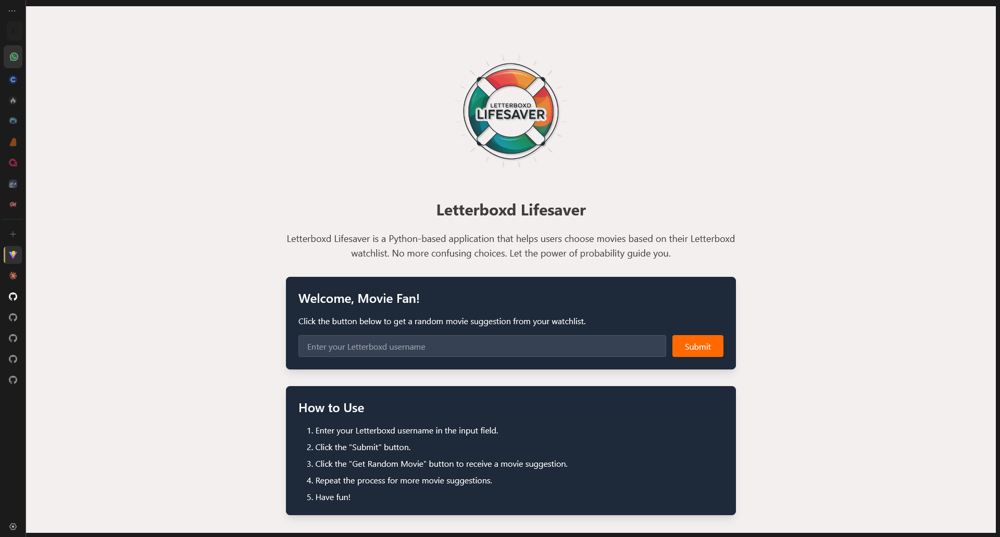

# Letterboxd Lifesaver

> No more watchlist paralysis. Let the power of probability guide your next movie night.

Letterboxd Lifesaver is a web application that helps users choose movies based on their Letterboxd watchlist. Simply enter your Letterboxd username, and let the app randomly select a movie for you to watch, complete with poster images and details.



## Features

- **Watchlist Integration**: Seamlessly retrieves your Letterboxd watchlist using your public username
- **Random Selection**: Uses a sophisticated randomization algorithm to suggest a movie from your watchlist
- **Visual Display**: Shows movie posters alongside titles for a better visual experience
- **Responsive Design**: Works on desktop, tablet, and mobile devices
- **API Backend**: Flask-based backend with a React frontend for a modern user experience

## Tech Stack

- **Backend**: Python with Flask
- **Frontend**: React.js
- **Data Source**: Letterboxd public watchlists via web scraping
- **Deployment**: Can be deployed on any web server that supports Python and Node.js

## Getting Started

To get started with Letterboxd Lifesaver, follow these steps:

### Prerequisites

- Python 3.7+
- Node.js 14+
- npm or yarn

### Installation

1. Clone this repository to your local machine:

```bash
git clone https://github.com/your-username/letterboxd-lifesaver.git
cd letterboxd-lifesaver
```

2. Set up the backend:

```bash
# Create and activate a virtual environment (optional but recommended)
python -m venv venv
source venv/bin/activate  # On Windows use: venv\Scripts\activate

# Install backend dependencies
pip install -r requirements.txt
```

3. Set up the frontend:

```bash
cd frontend
npm install  # or: yarn install
npm run build  # or: yarn build
cd ..
```

### Running the Application

1. Start the Flask server:

```bash
python app.py
```

2. Open your browser and navigate to:

```
http://localhost:5000
```

## Usage

1. Enter your Letterboxd username in the input field
2. Click "Find a Movie" button
3. View your randomly selected movie with its poster
4. If you don't like the suggestion, click "Try Again" for a new selection

## API Endpoints

- `POST /api/suggest`: Accepts a JSON body with a `username` field, returns a randomly selected movie from the user's watchlist
- `GET /api/test_image`: Test endpoint to verify image URL accessibility

## Troubleshooting

- **Images not displaying?** Check your browser's console for any CORS errors. The app includes CORS handling, but some hosting environments might need additional configuration.
- **No movies found?** Ensure your Letterboxd watchlist is public and contains movies.
- **Server errors?** Check the Flask console output for detailed error logs.

## Contributing

Contributions are welcome! If you find any bugs or have ideas for new features, please:

1. Fork the repository
2. Create a feature branch (`git checkout -b feature/amazing-feature`)
3. Commit your changes (`git commit -m 'Add some amazing feature'`)
4. Push to the branch (`git push origin feature/amazing-feature`)
5. Open a Pull Request


Made with ❤️ for movie lovers who can never decide what to watch